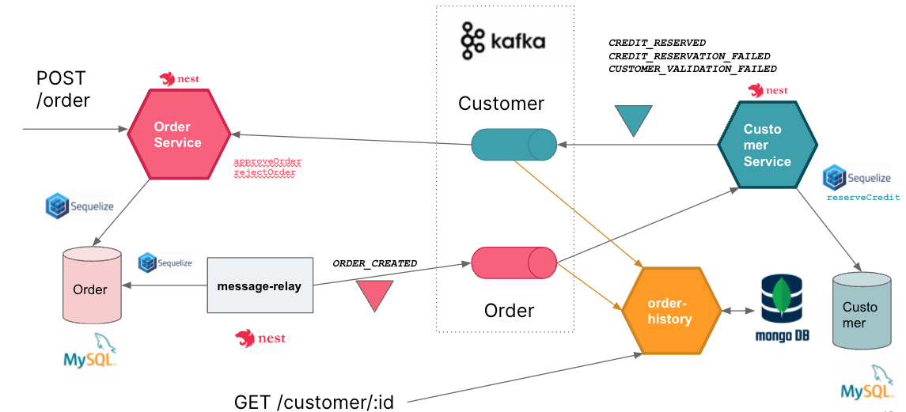

# Order History Service

The `Order History Service` implements an API for consulting the order history for a given customer.
The service implements the [CQRS Pattern](https://microservices.io/patterns/data/cqrs.html), using a mongo database, to keep a replica of all the events related to Orders and Customers, using event handlers (consumers for those topics). A view is designed to support the query: **Get all the orders by a given customer**.

